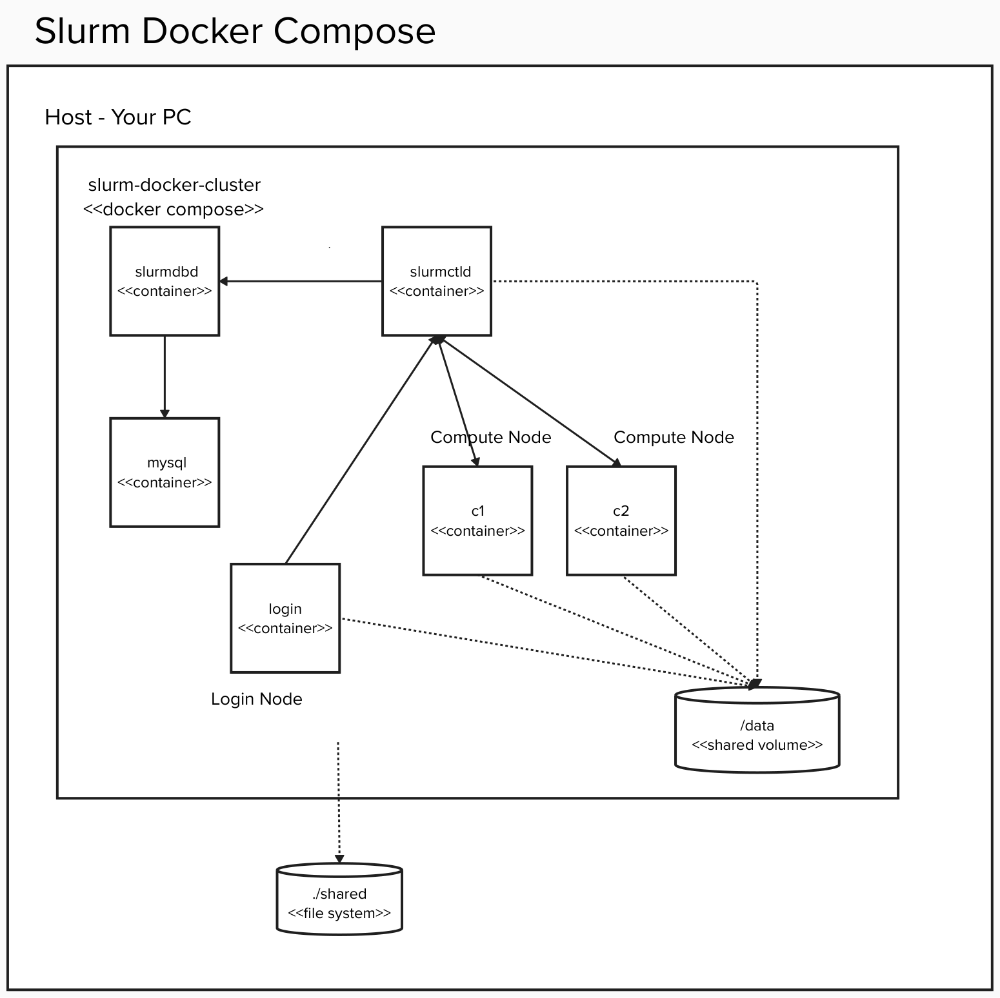

# Installation

This document describes how to setup development environment and the plugins developed in this project.


## Setup Local Development Environment

### Jump To:
- [Pre-requisites](#pre-requisites)
- [Creating Docker-based Slurm Cluster](#creating-docker-based-slurm-cluster)
- [Building and installing our SPANK Plugins](#building-and-installing-our-spank-plugins)
- [Running examples of primitive job in Slurm Cluster](#running-examples-of-primitive-job-in-slurm-cluster)


### Pre-requisites

- [Podman](https://podman.io/getting-started/installation.html) or [Docker](https://docs.docker.com/get-docker/) installed. You can use [Rancher Desktop](https://rancherdesktop.io/) instead of installing Docker on your PC.


### Creating Docker-based Slurm Cluster

You can skip below steps if you already have Slurm Cluster for development.

#### 1. Creating your workspace on your PC
```bash
mkdir -p <YOUR WORKSPACE>
cd <YOUR WORKSPACE>
```

#### 2. Cloning Slurm Docker Cluster git repository 

```bash
git clone https://github.com/giovtorres/slurm-docker-cluster.git
cd slurm-docker-cluster
```

#### 3. Cloning qiskit-community/spank-plugins

```bash
mkdir shared
pushd shared
git clone git@github.com:qiskit-community/spank-plugins.git
popd
```

#### 4. Applying a patch to slurm-docker-cluster

```bash
patch -p1 < ./shared/spank-plugins/demo/qrmi/slurm-docker-cluster/file.patch
```

Rocky Linux 9 is used as default. If you want to another  operating system, apply additional patch.

##### CentOS Stream 9

```bash
patch -p1 < ./shared/spank-plugins/demo/qrmi/slurm-docker-cluster/centos9.patch
```

##### CentOS Stream 10

```bash
patch -p1 < ./shared/spank-plugins/demo/qrmi/slurm-docker-cluster/centos10.patch
```

#### 5. Building containers

```bash
docker compose build --no-cache
```

#### 6. Creating a directory for MinIO S3 Bucket

```bash
mkdir minio
```

#### 7. Starting a cluster

```bash
docker compose up -d
```

> [!NOTE]
> Ensure that the following seven containers are running on the PC.
>
> - daapi ([Direct Access API Simulator](./daa_sim/README.md) node)
> - c2 (Compute Node #2)
> - c1 (Compute Node #1)
> - slurmctld (Central Management Node)
> - slurmdbd (Slurm DB Node)
> - slurm-docker-cluster-minio-1 (S3 Bucket Node, used by Direct Access)
> - mysql (Database node)

Slurm Cluster is now set up as shown.

<p align="center">
  
</p>


#### 8. Creating a S3 bucket for testing

S3 Bucket creation can be done via a)Web Browser or b)CLI.

a) Using MinIO Object Browser
- Open http://localhost:9001 with your browser running on your Host
- Login with minioadmin / minioadmin
- Click 'Create a Bucket' hyperlink in Object Browser tab
- Specify `slurm-qrun` as Bucket Name.
- Click 'Create Bucket'


b) Using CLI

```bash
% docker exec -it slurm-docker-cluster-minio-1 bash
bash-5.1# mc alias set local http://localhost:9000 minioadmin minioadmin
bash-5.1# mc alias list
gcs
  URL       : https://storage.googleapis.com
  AccessKey : YOUR-ACCESS-KEY-HERE
  SecretKey : YOUR-SECRET-KEY-HERE
  API       : S3v2
  Path      : dns
  Src       : /tmp/.mc/config.json

local
  URL       : http://localhost:9000
  AccessKey : minioadmin
  SecretKey : minioadmin
  API       : s3v4
  Path      : auto
  Src       : /tmp/.mc/config.json

play
  URL       : https://play.min.io
  AccessKey : Q3AM3UQ867SPQQA43P2F
  SecretKey : zuf+tfteSlswRu7BJ86wekitnifILbZam1KYY3TG
  API       : S3v4
  Path      : auto
  Src       : /tmp/.mc/config.json

s3
  URL       : https://s3.amazonaws.com
  AccessKey : YOUR-ACCESS-KEY-HERE
  SecretKey : YOUR-SECRET-KEY-HERE
  API       : S3v4
  Path      : dns
  Src       : /tmp/.mc/config.json

bash-5.1# mc mb local/slurm-qrun
bash-5.1# exit
```

### Building and installing our SPANK Plugins


> [!NOTE]
> The following explanation assumes:
> - using Slurm Docker Cluster set up above. If you use other existing environments, do the equivalent.
> - building code on `slurmctld` node. Other nodes are also acceptable.


1. Login to slurmctld container
```bash
% docker exec -it slurmctld bash
```

2. Creating python virtual env under shared volume

```bash
[root@slurmctld /]# python3.12 -m venv /shared/pyenv
[root@slurmctld /]# pip install --upgrade pip
```

3. Building [QRMI](./qrmi/README.md)

```bash
% docker exec -it slurmctld bash

[root@slurmctld /]# source ~/.cargo/env
[root@slurmctld /]# source /shared/pyenv/bin/activate
[root@slurmctld /]# cd /shared/spank-plugins/qrmi
[root@slurmctld /]# pip install -r requirements-dev.txt
[root@slurmctld /]# maturin develop --release
```

4. Building [Primitives](./primitives/python/README.md)

```bash
[root@slurmctld /]# cd /shared/spank-plugins/primitives/python/qiskit_qrmi_primitives
[root@slurmctld /]# pip install .
[root@slurmctld /]# cd examples/ibm
[root@slurmctld /]# pip install -r requirements.txt
[root@slurmctld /]# cd /shared/spank-plugins/primitives/python/pulser_qrmi_backend
[root@slurmctld /]# pip install .
[root@slurmctld /]# cd examples/pasqal
[root@slurmctld /]# pip install -r requirements.txt
```

5. Building [SPANK Plugin](./plugins)

```bash
[root@slurmctld /]# cd /shared/spank-plugins/plugins/spank_qrmi
[root@slurmctld /]# mkdir build
[root@slurmctld /]# cd build
[root@slurmctld /]# cmake ..
[root@slurmctld /]# make
```

6. Creating qrmi_config.json

Refer [this example](./plugins/spank_qrmi/qrmi_config.json.example) and describe your environment. Then, create a file under /etc/slurm or other where slurm daemons can access.

7. Installing SPANK Plugins

Create `/etc/slurm/plugstack.conf` if not exists and add the following lines:
```bash
optional /shared/spank-plugins/plugins/spank_qrmi/build/spank_qrmi.so /etc/slurm/qrmi_config.json
```

Above example assumes you create qrmi_config.json under /etc/slurm directory.

> [!NOTE]
> When you setup your own slurm cluster, `plugstack.conf`, `qrmi_config.json` and above plugin libraries need to be installed on the machines that execute slurmd (compute nodes) as well as on the machines that execute job allocation utilities such as salloc, sbatch, etc (login nodes). Refer [SPANK documentation](https://slurm.schedmd.com/spank.html#SECTION_CONFIGURATION) for more details.

8. Checking SPANK Plugins installation

If you complete above step, you must see additional options of `sbatch` like below.

```bash
[root@slurmctld /]# sbatch --help

Options provided by plugins:
      --qpu=names             Comma separated list of QPU resources to use.
```

### Running examples of primitive job in Slurm Cluster

1. Loging in to slurmctld node

```bash
% docker exec -it slurmctld bash
```

2. Running Sampler job

run_sampler.sh
```bash
#!/bin/bash

#SBATCH --job-name=sampler_job
#SBATCH --ntasks=1
#SBATCH --cpus-per-task=1
#SBATCH --qpu=test_heron,test_eagle <<<< CUSTOMIZE THIS LINE!!! TO BE CONSISTENT WITH qrmi_config.json

# Your script goes here
source /shared/pyenv/bin/activate
srun python /shared/spank-plugins/primitives/python/qiskit_qrmi_primitives/examples/ibm/sampler.py
```

```bash
[root@slurmctld /]# sbatch run_sampler.sh
```
 
3. Running Estimator job

run_estimator.sh
```bash
#!/bin/bash

#SBATCH --job-name=estimator_job
#SBATCH --ntasks=1
#SBATCH --cpus-per-task=1
#SBATCH --qpu=test_heron,test_eagle <<<< CUSTOMIZE THIS LINE!!! TO BE CONSISTENT WITH qrmi_config.json

# Your script goes here
source /shared/pyenv/bin/activate
srun python /shared/spank-plugins/primitives/python/qiskit_qrmi_primitives/examples/ibm/estimator.py
```

```bash
[root@slurmctld /]# sbatch run_estimator.sh
```
 

4. Running Pasqal job

run_pulser_backend.sh
```bash
#!/bin/bash

#SBATCH --job-name=pasqal_job
#SBATCH --ntasks=1
#SBATCH --cpus-per-task=1
#SBATCH --qpu=FRESNEL <<<< CUSTOMIZE THIS LINE!!! TO BE CONSISTENT WITH qrmi_config.json

# Your script goes here
source /shared/pyenv/bin/activate
srun python /shared/spank-plugins/primitives/python/pulser_qrmi_backend/examples/pasqal/pulser_backend.py
```

```bash
[root@slurmctld /]# sbatch run_pulser_backend.sh
```


5. Checking primitive results

Once above scripts are completed, you must find `slurm-{job_id}.out` in the current directory.

For example,
```bash
[root@slurmctld /]# cat slurm-81.out
{'backend_name': 'test_eagle'}
>>> Observable: ['IIIIIIIIIIIIIIIIIIIIIIIIIIIIIIIIIIIIIIIIIIIIIIIIII...',
 'IIIIIIIIIIIIIIIIIIIIIIIIIIIIIIIIIIIIIIIIIIIIIIIIII...',
 'IIIIIIIIIIIIIIIIIIIIIIIIIIIIIIIIIIIIIIIIIIIIIIIIII...',
 'IIIIIIIIIIIIIIIIIIIIIIIIIIIIIIIIIIIIIIIIIIIIIIIIII...',
 'IIIIIIIIIIIIIIIIIIIIIIIIIIIIIIIIIIIIIIIIIIIIIIIIII...',
 'IIIIIIIIIIIIIIIIIIIIIIIIIIIIIIIIIIIIIIIIIIIIIIIIII...',
 'IIIIIIIIIIIIIIIIIIIIIIIIIIIIIIIIIIIIIIIIIIIIIIIIII...',
 'IIIIIIIIIIIIIIIIIIIIIIIIIIIIIIIIIIIIIIIIIIIIIIIIII...',
 'IIIIIIIIIIIIIIIIIIIIIIIIIIIIIIIIIIIIIIIIIIIIIIIIII...',
 'IIIIIIIIIIIIIIIIIIIIIIIIIIIIIIIIIIIIIIIIIIIIIIIIII...',
 'IIIIIIIIIIIIIIIIIIIIIIIIIIIIIIIIIIIIIIIIIIIIIIIIII...',
 'IIIIIIIIIIIIIIIIIIIIIIIIIIIIIIIIIIIIIIIIIIIIIIIIII...',
 'IIIIIIIIIIIIIIIIIIIIIIIIIIIIIIIIIIIIIIIIIIIIIIIIII...',
 'IIIIIIIIIIIIIIIIIIIIIIIIIIIIIIIIIIIIIIIIIIIIIIIIII...',
 'IIIIIIIIIIIIIIIIIIIIIIIIIIIIIIIIIIIIIIIIIIIIIIIIII...', ...]
>>> Circuit ops (ISA): OrderedDict([('rz', 2724), ('sx', 1185), ('ecr', 576), ('x', 288)])
>>> Job ID: 0b1965a6-7473-4efc-aea2-6e2f1c843e5b
>>> Job Status: JobStatus.RUNNING
>>> PrimitiveResult([PubResult(data=DataBin(evs=np.ndarray(<shape=(), dtype=float64>), stds=np.ndarray(<shape=(), dtype=float64>), ensemble_standard_error=np.ndarray(<shape=(), dtype=float64>)), metadata={'shots': 4096, 'target_precision': 0.015625, 'circuit_metadata': {}, 'resilience': {}, 'num_randomizations': 32})], metadata={'dynamical_decoupling': {'enable': False, 'sequence_type': 'XX', 'extra_slack_distribution': 'middle', 'scheduling_method': 'alap'}, 'twirling': {'enable_gates': False, 'enable_measure': True, 'num_randomizations': 'auto', 'shots_per_randomization': 'auto', 'interleave_randomizations': True, 'strategy': 'active-accum'}, 'resilience': {'measure_mitigation': True, 'zne_mitigation': False, 'pec_mitigation': False}, 'version': 2})
  > Expectation value: 0.16554467382152394
  > Metadata: {'shots': 4096, 'target_precision': 0.015625, 'circuit_metadata': {}, 'resilience': {}, 'num_randomizations': 32}
```

### Running serialized jobs using the qrmi_task_runner Slurm Cluster

It is possible to run JSON-serialized jobs directly using a commandline utility called qrmi_task runner.
See [the docs](./commands/task_runner/README.md) for that tool for details.

## END OF DOCUMENT
