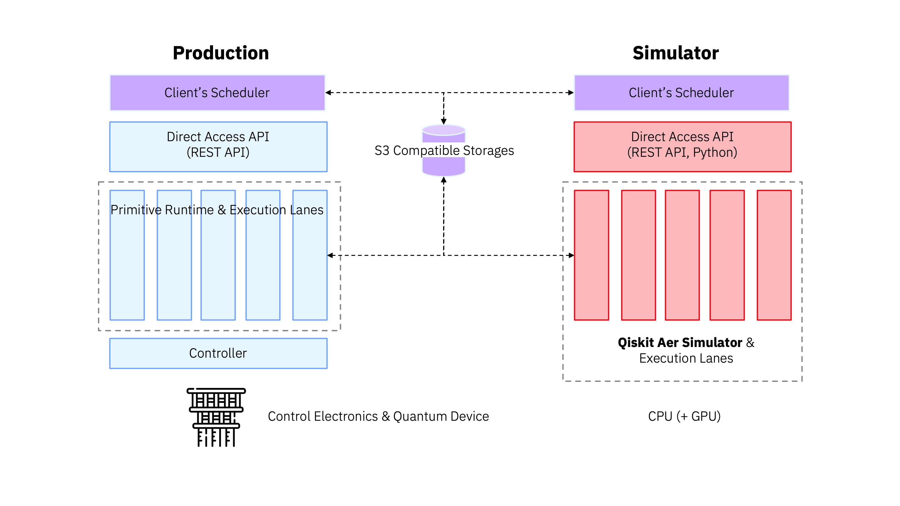

# Direct Access API Simulator (daa_sim)

This API simulator is a portable, locally executable application built with [Qiskit Aer Simulator](https://github.com/Qiskit/qiskit-aer) as a backend. Direct Access API client developers can use this API simulator to develop and test API clients without having access to the actual quantum backend or Direct Access API instance, increasing development productivity. Developers can use their Linux (RedHat, Ubuntu), MacOS and Windows machine to run this API simulator, and it supports Python 3.11 or above versions as runtime.

<p align="center">
  
</p>

To start this API simulator and run a job, the setup of S3 compatible storage such as MinIO or IBM Cloud Object Storage is required separately. Small HOWTO documents are available in [this directory](../docs/howtos) for your setup.

Following backends are available as default in the API responses returned by this API simulator.
- FakeTorino (133 qubits)
- FakeBrisbane (127 qubits)
- FakeCairoV2 (27 qubits)
- FakeLagosV2 (7qubits)

Because it uses the Qiskit Aer Simulator, there are some limitations compared to the actual Direct Access API service deployed, see the “Limitations” section of this document for more information.

Following Direct Access APIs are provided by the current version of this API simulator. For more details, refer [API Document](#api-document) or one provided by IBM Quantum.

* Version
  * `GET /version`
* Authentication
  * `POST /v1/token`
* Backends
  * `GET /v1/backends`
  * `GET /v1/backends/{backend-name}`
  * `GET /v1/backends/{backend-name}/configuration`
  * `GET /v1/backends/{backend-name}/properties`
  * `GET /v1/backends/{backend-name}/defaults`
* Jobs
  * `POST /v1/jobs`
  * `GET /v1/jobs`
  * `DELETE /v1/jobs/{job_id}`
  * `POST /v1/jobs/{job_id}/cancel`

> [!NOTE]
> Following 2 authentication methods are deprecated. Use IAM API key-based authentication.
> - IBM App ID
> - Shared token

## Prerequisites

* Python 3.11 or above


## Installation

We recommend using [Python virtual environments](https://docs.python.org/3/library/venv.html) to cleanly separate Qiskit from other applications.
```bash
python3.11 -m venv ~/daa_sim
source ~/daa_sim/bin/activate
```

### Install from source

```bash
git clone git@github.com:qiskit-community/spank-plugins.git
cd spank-plugins/daa_sim
pip install .
```

### Installation verification

```bash
% pip show direct-access
Name: direct-access
Version: 0.1.0
Summary: Direct Access API Simulator
Home-page: https://quantum.ibm.com/
Author: IBM Quantum
Author-email: qiskit@us.ibm.com
License: Apache 2.0
Location: /Users/ohtanim/py311_daa_sim_1006_0/lib/python3.11/site-packages
Requires: boto3, fastapi, numpy, pyjwt, PyYAML, qiskit, qiskit-aer, qiskit-ibm-runtime, qiskit-qasm3-import, sympy, urllib3, uvicorn
Required-by: 
```

> [!NOTE]
>
> If `pip install` command fails due to `UnicodeDecodeError: 'cp932' codec can't decode byte` error on Windows, rerun the install after setting `PYTHONUTF8` environment varilable like below.
> ```bash
> set PYTHONUTF8=1
> ```
 
## Program arguments

```bash
% daa_sim --help
usage: daa_sim [-h] [--log-config LOG_CONFIG] config

Direct Access API Simulator

positional arguments:
  config                Configuration file(.yaml)

options:
  -h, --help            show this help message and exit
  --log-config LOG_CONFIG
                        Configuration file(.yaml) for python standard logging mechanism.
```


## Configuration

You can customize your installation with various parameters by editing the [config.yaml](./config.yaml) file and specifying it as program arguments.

| Properties | Type | Descriptions |
| ---- | ---- | ---- |
| $.host | str | Bind address of API endpoint. Default is "0.0.0.0". |
| $.port | int | Bind port of API endpoint. Default is 8290. |
| $.backends | list[dict[str, str]] | Backend list to override default backends. Refer [Customizing backend list](./docs/customizing_backend_list.md)  for more details. |
| $.api_workers | int | Number of API endpoint worker processes. Increase according to the frequency of API calls and their expected latency. Default is 1. |
| $.max_execution_lanes | int | Maximum number of the execution lanes in Direct Access API. Default is 5. |
| $.auth.enabled | bool | true if authentication is enabled, false otherwise. Default is true. |
| $.auth.shared_token | dict[str, str] | Deprecated. A list of client id and its token pairs. Required when using shared token-based authentication. |
| $.auth.token_endpoint_credentials | dict[str, str] | Deprecated. userid and password used by basic authentication for /v1/token endpoint. Required when using access token-based authentication. |
| $.auth.iam_apikeys | list[str] | IAM API keys for /v1/token endpoint. Required when using IAM API key-based authentication. |
| $.auth.access_token.ttl | int | TTL of access token in seconds. Default is 3600. Required when using access token-based authentication.|
| $.aer_options.estimatorV2 | dict | Optional for EstimatorV2 runtime. Options passed to `AerSimulator` with key `backend_options` and options passed to `AerSimulator.run()` with key `run_options`. Refer [this document](./docs/aer_configuration.md) for more details. |
| $.aer_options.samplerV2 | dict | Optional for SamplerV2 runtime. Options passed to `AerSimulator` with key `backend_options` and options passed to `AerSimulator.run()` with key `run_options`. Refer [this document](./docs/aer_configuration.md) for more details. |


## Logging

[logging.yaml](./direct_access_client/daa_sim/logging.yaml) is default configuration of logging. Logging output can be customized by specifying your file to `--log-config` argument.


## Run this application

```bash
% daa_sim config.yaml

<Ctrl+C to exit>
```

## Jupyter Notebooks

Once the API simulator is up and running, the API is ready to use. There are [2 examples](./docs/tutorials/README.md), one is running SamplerV2 and another is running EstimatorV2 job, available in the form of Jupyter Notebook. Recommend to take a look at and run these examples for verifying your setup and getting started.


## API Document

You will have two different API documents available if you run this API simulator on your machine.
* Swagger ([Link](http://0.0.0.0:8290/docs))
* ReDoc ([Link](http://0.0.0.0:8290/redoc))


## Limitations

### Get list of backends (GET /v1/backends)

- `status` in the returned backends is always `online`
- Optional fields (`message`, `version`) are not included in the response.

### Get backend details (GET /v1/backends/{backend_name})

- `status` in the returned backends is always `online`
- Optional fields (`message`, `version`) are not included in the response.

### Get backend pulse defaults (GET /v1/backends/{backend_name}/defaults)

- Returns an empty JSON if `backend_name` is specified as `aer`.

### Get jobs (GET /v1/jobs)

- The value of `reason_message` and `reason_solution` fields may differ from the values in the Direct Access API production deployment.

### Run a job (POST /v1/jobs)

- `timeout_secs` is not supported and ignored if specified.
- Functionalities to return the errors with status code 408, 413 and 423 are not not supported.
- For EstimatorV2 jobs, [Options for V2 Estimator](https://github.com/Qiskit/ibm-quantum-schemas/blob/main/schemas/estimator_v2_schema.json#L24) except `default_precision` are not supported. Those properties will be ignored at job runtime with displaying warning message on console like below.
```bash
2024-09-13 14:44:20,512 daa_sim.daa_service WARNING 216021 [daa_service.py:743] Unsupported option default_option=5000 specified. Ignored.
```
- For SamplerV2 jobs, [Options for V2 Sampler](https://github.com/Qiskit/ibm-quantum-schemas/blob/main/schemas/sampler_v2_schema.json#L23) are also not supported. Those properties will be ignored at job runtime with displaying warning message.

