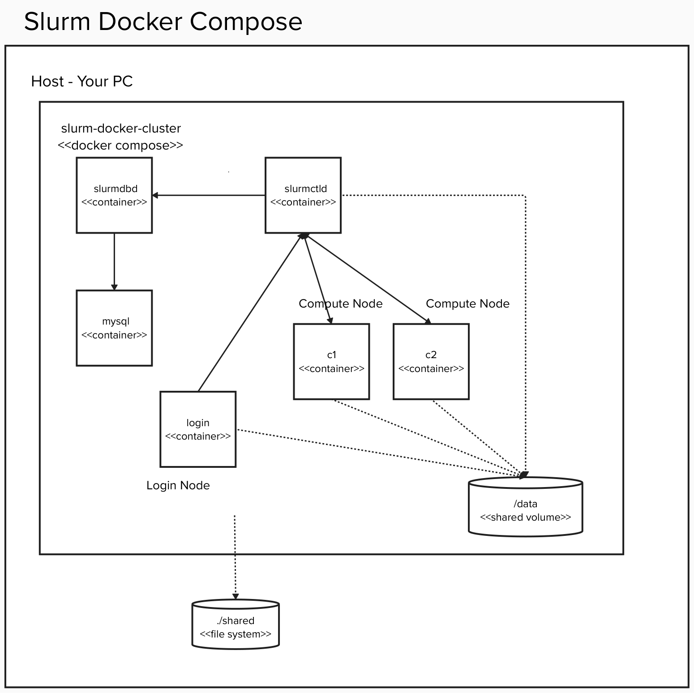

# Installation

This document describes how to set up a local, container-based, Slurm development environment and how to build and install QRMI and the SPANK plugin in a Slurm cluster.

## Set Up Local Development Environment

### Jump To
- [Prerequisite](#prerequisite)
- [Creating Docker-based Slurm Cluster](#creating-docker-based-slurm-cluster)
- [Building and Installing QRMI and the SPANK Plugin](#building-and-installing-qrmi-and-the-spank-plugin)
- [Running Primitive Job Examples in Slurm Cluster](#running-primitive-job-examples-in-slurm-cluster)
- [Running Serialized Jobs Using the QRMI Task Runner](#running-serialized-jobs-using-the-qrmi-task-runner)

### Prerequisite

A container manager such as [Podman](https://podman.io/getting-started/installation.html), [Rancher Desktop](https://rancherdesktop.io/), or [Docker](https://docs.docker.com/get-docker/).


### Creating Docker-based Slurm Cluster

#### 1. Creating your local workspace

```bash
mkdir -p <YOUR WORKSPACE>
cd <YOUR WORKSPACE>
```

#### 2. Cloning Slurm Docker Cluster git repository 

```bash
git clone -b 0.9.0 https://github.com/giovtorres/slurm-docker-cluster.git
cd slurm-docker-cluster
```

Slurm Docker Cluster v0.9.0 uses SLURM_TAG defined in slurm-docker-cluster/.env to specify the Slurm version. Currently, SLURM_TAG is set to slurm-25-05-3-1. This corresponds to a tag in Slurm's major release 25.05 from May 2025. Using a Slurm release prior to slurm-24-05-5-1 requires rebuilding the SPANK plugin with -DPRIOR_TO_V24_05_5_1 due to interface changes in slurm-24-05-5-1.

#### 3. Cloning qiskit-community/spank-plugins and qiskit-community/qrmi

```bash
mkdir shared
pushd shared
git clone https://github.com/qiskit-community/spank-plugins.git
git clone https://github.com/qiskit-community/qrmi.git
popd
```

#### 4. Applying a patch to slurm-docker-cluster

```bash
patch -p1 < ./shared/spank-plugins/demo/qrmi/slurm-docker-cluster/file.patch
```

Rocky Linux 9 is used as default. If you want another operating system, you must apply an additional patch (see below for CentOS 9 and CentOS 10 examples). The patch is used to avoid the Slurm Docker Cluster requirement to include its copyright notice in repositories that copy the Slurm Docker Cluster code.

##### CentOS Stream 9

```bash
patch -p1 < ./shared/spank-plugins/demo/qrmi/slurm-docker-cluster/centos9.patch
```

##### CentOS Stream 10

```bash
patch -p1 < ./shared/spank-plugins/demo/qrmi/slurm-docker-cluster/centos10.patch
```

#### 5. Building containers

```bash
docker compose build --no-cache
```

Podman users must install `docker-compose`. MacOS users can do this with `brew install docker-compose`.

#### 6. Starting a cluster

```bash
docker compose up -d
```

Use `docker ps` to check that the following 6 containers are running:

- c2 (Compute Node #2)
- c1 (Compute Node #1)
- slurmctld (Central Management Node)
- slurmdbd (Slurm DB Node)
- login (Login Node)
- mysql (Database node)

You now have a Slurm cluster as shown below:

<p align="center">
  
</p>

## Building and Installing QRMI and the SPANK plugin

The following steps assume you are building code on `c1` (Compute Node #1). Other nodes are also acceptable.

1. Log in to c1

```bash
docker exec -it c1 bash
```

2. Creating python virtual env under shared volume **on c1**

```bash
python3.12 -m venv /shared/pyenv
source /shared/pyenv/bin/activate
pip install --upgrade pip
```

3. Building and installing [QRMI](https://github.com/qiskit-community/qrmi/blob/main/INSTALL.md) **on c1**

```bash
source ~/.cargo/env
cd /shared/qrmi
pip install -r requirements-dev.txt
maturin build --release
pip install /shared/qrmi/target/wheels/qrmi-*.whl
```

4. Building the [SPANK plugin](../../../plugins/spank_qrmi/README.md) **on c1**

```bash
cd /shared/spank-plugins/plugins/spank_qrmi
mkdir build
cd build
cmake ..
make
```

This will install QRMI from the [QRMI git repository](https://github.com/qiskit-community/qrmi). If you are building locally for development it might be easier to build QRMI from source mounted at `/shared/qrmi` as shown below:

```bash
cd /shared/spank-plugins/plugins/spank_qrmi
mkdir build
cd build
cmake -DQRMI_ROOT=/shared/qrmi ..
make
```

5. Creating qrmi_config.json

Modify [this example](https://github.com/qiskit-community/spank-plugins/blob/main/plugins/spank_qrmi/qrmi_config.json.example) to fit your environment and add it to `/etc/slurm` or another location accessible to the Slurm daemons on each compute node you intend to use.

IBM Quantum Platform (IQP) provides limited, free access to IBM Quantum systems. After registering with IBM Cloud and IQP, the list of accessible IBM Quantum systems can be found [here](https://quantum.cloud.ibm.com/computers). The qrmi_config.json file will require an API key and a CRN for each IQP system. API key instructions can be found [here](https://cloud.ibm.com/iam/apikeys). The CRN for each IQP system can be found [here](https://quantum.cloud.ibm.com/computers). For example, click on "ibm_torino" then open the “Instance access” section for the "ibm_torino" CRN.

6. Installing the SPANK plugin

Create `/etc/slurm/plugstack.conf` and ensure it has the following line (assuming `qrmi_config.json` was added to `/etc/slurm`):

```bash
optional /shared/spank-plugins/plugins/spank_qrmi/build/spank_qrmi.so /etc/slurm/qrmi_config.json
```

`plugstack.conf`, `qrmi_config.json`, and `spank_qrmi.so` must be installed on the machines that execute slurmd (compute nodes) as well as on the machines that execute job allocation utilities such as salloc, sbatch, etc (login nodes). Refer to the [SPANK documentation](https://slurm.schedmd.com/spank.html#SECTION_CONFIGURATION) for more details.

7. Checking SPANK plugin installation

After completing the steps above, `sbatch --help` should show the QPU resource option as shown below:

```bash
[root@c1 /]# sbatch --help

Options provided by plugins:
      --qpu=names             Comma separated list of QPU resources to use.
```

### Running Primitive Job Examples in Slurm Cluster

1. Logging in to the login node

```bash
docker exec -it login bash
cd /data # Or another directory shared between the login and compute nodes
```

2. Running Sampler job on the **login node**

```bash
sbatch /shared/spank-plugins/demo/qrmi/jobs/run_sampler.sh
```
 
3. Running Estimator job on the **login node**

```bash
sbatch /shared/spank-plugins/demo/qrmi/jobs/run_estimator.sh
```

4. Running Pasqal job on the **login node**

```bash
sbatch /shared/spank-plugins/demo/qrmi/jobs/run_pulser_backend.sh
```

5. Checking primitive results

You should find `slurm-{job_id}.out` files in the current directory. For example,

```bash
cat slurm-81.out # Assuming job_id is 81
{'backend_name': 'test_eagle'}
>>> Observable: ['IIIIIIIIIIIIIIIIIIIIIIIIIIIIIIIIIIIIIIIIIIIIIIIIII...',
 'IIIIIIIIIIIIIIIIIIIIIIIIIIIIIIIIIIIIIIIIIIIIIIIIII...',
 'IIIIIIIIIIIIIIIIIIIIIIIIIIIIIIIIIIIIIIIIIIIIIIIIII...',
 'IIIIIIIIIIIIIIIIIIIIIIIIIIIIIIIIIIIIIIIIIIIIIIIIII...',
 'IIIIIIIIIIIIIIIIIIIIIIIIIIIIIIIIIIIIIIIIIIIIIIIIII...',
 'IIIIIIIIIIIIIIIIIIIIIIIIIIIIIIIIIIIIIIIIIIIIIIIIII...',
 'IIIIIIIIIIIIIIIIIIIIIIIIIIIIIIIIIIIIIIIIIIIIIIIIII...',
 'IIIIIIIIIIIIIIIIIIIIIIIIIIIIIIIIIIIIIIIIIIIIIIIIII...',
 'IIIIIIIIIIIIIIIIIIIIIIIIIIIIIIIIIIIIIIIIIIIIIIIIII...',
 'IIIIIIIIIIIIIIIIIIIIIIIIIIIIIIIIIIIIIIIIIIIIIIIIII...',
 'IIIIIIIIIIIIIIIIIIIIIIIIIIIIIIIIIIIIIIIIIIIIIIIIII...',
 'IIIIIIIIIIIIIIIIIIIIIIIIIIIIIIIIIIIIIIIIIIIIIIIIII...',
 'IIIIIIIIIIIIIIIIIIIIIIIIIIIIIIIIIIIIIIIIIIIIIIIIII...',
 'IIIIIIIIIIIIIIIIIIIIIIIIIIIIIIIIIIIIIIIIIIIIIIIIII...',
 'IIIIIIIIIIIIIIIIIIIIIIIIIIIIIIIIIIIIIIIIIIIIIIIIII...', ...]
>>> Circuit ops (ISA): OrderedDict([('rz', 2724), ('sx', 1185), ('ecr', 576), ('x', 288)])
>>> Job ID: 0b1965a6-7473-4efc-aea2-6e2f1c843e5b
>>> Job Status: JobStatus.RUNNING
>>> PrimitiveResult([PubResult(data=DataBin(evs=np.ndarray(<shape=(), dtype=float64>), stds=np.ndarray(<shape=(), dtype=float64>), ensemble_standard_error=np.ndarray(<shape=(), dtype=float64>)), metadata={'shots': 4096, 'target_precision': 0.015625, 'circuit_metadata': {}, 'resilience': {}, 'num_randomizations': 32})], metadata={'dynamical_decoupling': {'enable': False, 'sequence_type': 'XX', 'extra_slack_distribution': 'middle', 'scheduling_method': 'alap'}, 'twirling': {'enable_gates': False, 'enable_measure': True, 'num_randomizations': 'auto', 'shots_per_randomization': 'auto', 'interleave_randomizations': True, 'strategy': 'active-accum'}, 'resilience': {'measure_mitigation': True, 'zne_mitigation': False, 'pec_mitigation': False}, 'version': 2})
  > Expectation value: 0.16554467382152394
  > Metadata: {'shots': 4096, 'target_precision': 0.015625, 'circuit_metadata': {}, 'resilience': {}, 'num_randomizations': 32}
```

### Running Serialized Jobs Using the QRMI Task Runner

It is possible to run JSON-serialized jobs directly using a commandline utility called qrmi_task_runner. See the [task_runner examples](https://github.com/qiskit-community/qrmi/python/qrmi/tools/README.md) for details.

## END OF DOCUMENT
