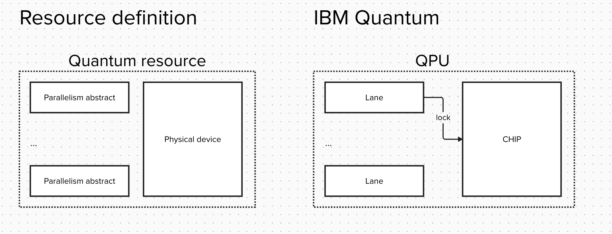
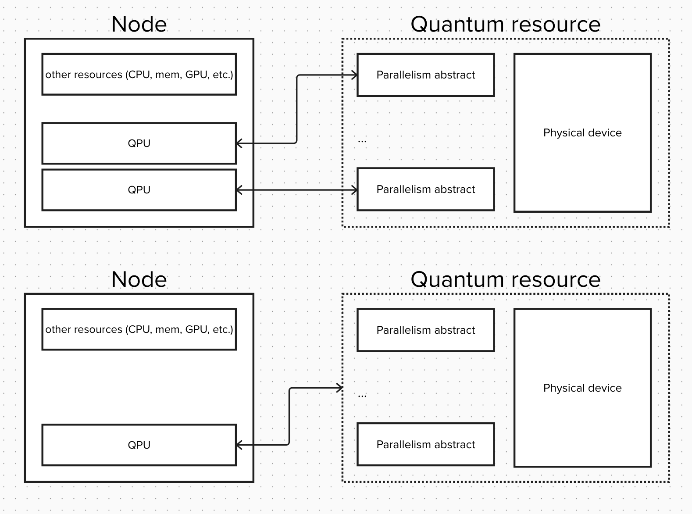
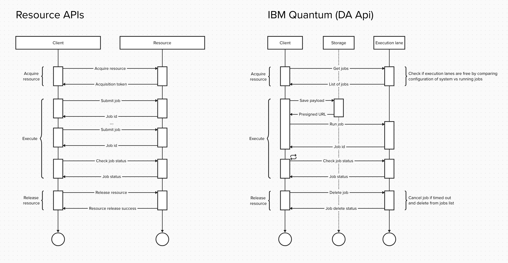
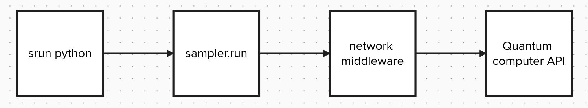
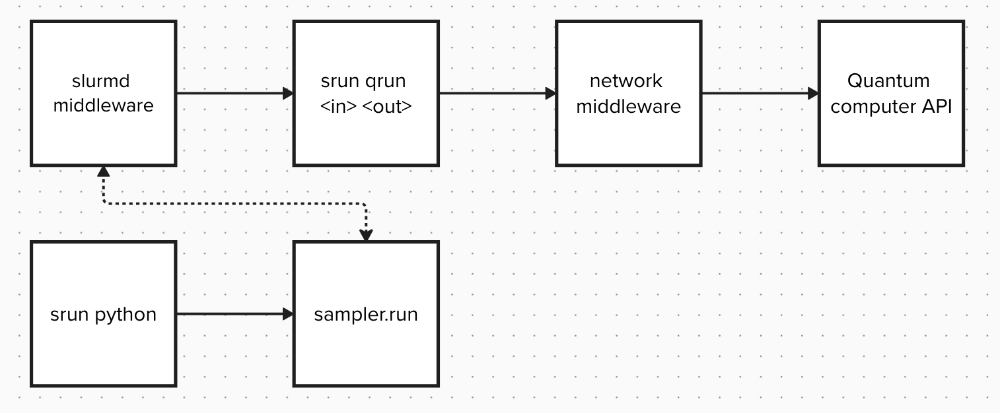
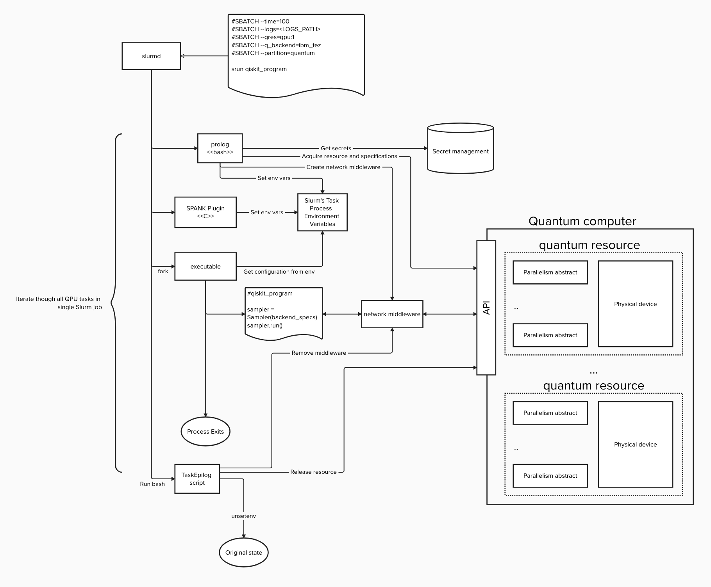

Spank plugins for Slurm to support quantum resources
====================================================

## Content

- [Definitions](#definitions)
  - [QPU](#qpu)
  - [Quantum computer](#quantum-computer)
  - [Spank plugins](#spank-plugins)
  - [Spank quantum plugin](#spank-quantum-plugin)
  - [Qiskit primitives (Sampler and Estimator)](#qiskit-primitives-sampler-and-estimator)
  - [Quantum resource for workload management systems](#quantum-resource-for-workload-management-system)
  - [Quantum resource API](#quantum-resource-api)
- [UX](#ux)
  - [Running primitive jobs](#running-primitive-jobs)
  - [Running hybrid quantum-classical job with multiple resources](#running-quantum-classical-job-with-multiple-resoures)
  - [Running complex workflows](#running-complex-workflows)
- [Integration options](#integration-options)
  - [Gres-like](#gres-like)
  - [Primitive jobs as separate Slurm job](#primitive-jobs-as-separate-slurm-job)
- [General architecture](#general-architecture-of-plugin)


## Definitions

### QPU
A `QPU` includes all of the hardware responsible for accepting an executable quantum instruction set, or a quantum circuit, and returning an accurate answer. That means the QPU includes the quantum chip(s) in a superconducting quantum computer, as well as additional components such as the amplifiers, control electronics, instruments.


### Quantum computer
A `Quantum Computer` is comprised of the QPU and the classical compute needed to execute requests coming in through an API (its endpoint).

### Spank plugins
`SPANK` provides a very generic interface for stackable plug-ins which may be used to dynamically modify the job launch code in Slurm. 
https://slurm.schedmd.com/spank.html

### Spank quantum plugin
A plugin in slurm that manages the operation of quantum jobs in slurm. It handles slurm resources related to quantum and is configured so that jobs can execute on Quantum Computers. 

### Qiskit primitives (Sampler and Estimator)
The two most common tasks for quantum computers are sampling quantum states and calculating expectation values. These tasks motivated the design of the Qiskit primitives: `Estimator` and `Sampler`.

- Estimator computes expectation values of observables with respect to states prepared by quantum circuits.
- Sampler samples the output register from quantum circuit execution.
In short, the computational model introduced by the Qiskit primitives moves quantum programming one step closer to where classical programming is today, where the focus is less on the hardware details and more on the results you are trying to achieve.

### Quantum resource for workload management system
General GRES (custom resource) for quantum computers is QPU. But there are additional resource definition might be needed depending on implementation from hardware vendors. Some vendors expose to parallelism within quantum computer as execution lanes, threads, parts of devices, etc.

Therefore we define quantum resource as an abstract that composed out of physical device and parallelism notion.



Therefore datacenter configuration can vary and map physical device to QPU Gres or parallelism abstract to QPU Gres.



### Quantum resource API
Any type of resource should implement resource control interface. Flow of working with resource following pattern: `acquire resource` → `execute` → `release resource`. Implementation of this interface might vary from platform to platform.



## UX

### Running primitive jobs

Slurm require executable for any of it's scommands. Therefore for running primitive tasks (sample and estimate) one might want to have cli interface like `qrun`.

```shell
#SBATCH --time=100
#SBATCH --output=<LOGS_PATH>
#SBATCH --gres=qpu:1
#SBATCH --q_backend=ibm_fez
#SBATCH --partition=quantum
#SBATCH --... # other options

srun qrun/sample/estimate <payload_path> <output_path>
```

### Running quantum-classical job with multiple resoures

For more traditional user experience working with Slurm and Qiskit one might use quantum-classical program as executable for slurm commands.

```shell
#SBATCH --time=100
#SBATCH --output=<LOGS_PATH>
#SBATCH --gres=qpu:1
#SBATCH --q_backend=ibm_fez
#SBATCH --partition=quantum
#SBATCH --... # other options

srun my_hybrid_quantum_classical_program.py
```

where `my_hybrid_quantum_classical_program.py` will be something like

```python
from qiskit_slurm_provider import Sampler

...

sampler = Sampler()
while ...:
    do_classical()
    ...
    isa_circuit = ...
    result = sampler.run([isa_circuit], ...).result()
    ...
    do_classical()

...
```

### Running complex workflows

In cases where one do not need fast interchange between quantum and classical resources it is benificial to separate program logic into separate jobs. For example preprocessing, quantum execution and postprocessing.

Preprocess classically and prepare quantum payload.
```shell
#SBATCH --partition=classical
#SBATCH --... # other options

srun preprocessing.py <payload_path>
```

Execute quantum payload.
```shell
#SBATCH --time=100
#SBATCH --output=<LOGS_PATH>
#SBATCH --gres=qpu:1
#SBATCH --q_backend=ibm_fez
#SBATCH --partition=quantum
#SBATCH --... # other options

srun qrun/sample/estimate <payload_path> <output_path>
```

Postprocess classically quantum results.
```shell
#SBATCH --partition=classical
#SBATCH --... # other options

srun postprocessing.py <output_path>
```

One can use any workflow management tool to chain this jobs into large workflow.


## Integration options

There are several integration options plugins can support. For example:
- Treating each job as a hybrid job, where QPU resource is associated to a job and tasks will have access to quantum computer API via primitives client. 
- Treating each primitive (sampler or estimator) jobs as separate Slurm job. Qiskit primitives client will be spawning separate jobs on each call.

Below we will give a little bit more details on each approach.

### Gres-like
Similar to any Gres resource (GPU, AIU, etc) we can treat QPU as gres and acquire it for whole duration of the job. 



### Primitive jobs as separate Slurm job

Other option will be treating each call of primitive client `sampler.run` as call for separate Slurm job. It is anti-pattern as one can lock themselves in resource block, but might increase utilization of devices.




## General architecture of plugin

Quantum plugin will be using Spank architecture events sequence of call during job execution to inject necessary logic to work with quantum computer API.

1. Job execution flow
    1. Prolog
        1. Handle secrets
        2. Acquire resource
        3. Create network middleware
    2. Task init
        1. Handle options
        2. Set env variables
    3. Epilog
        1. Remove middleware
        2. Release resource


