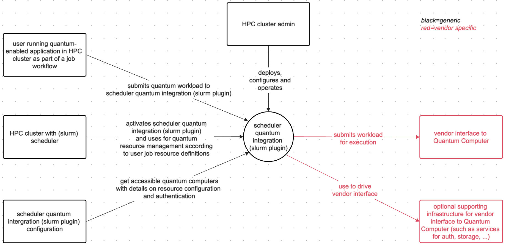
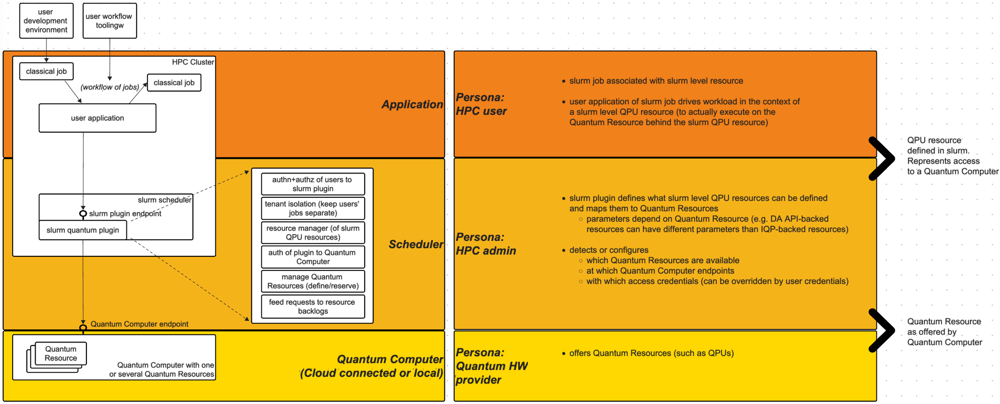
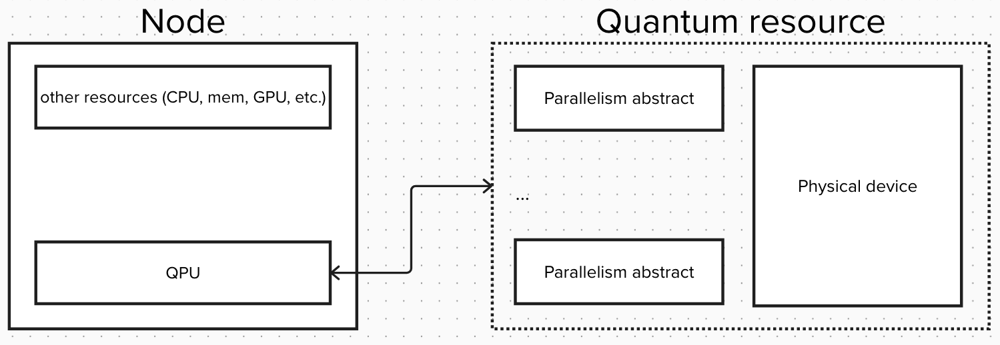
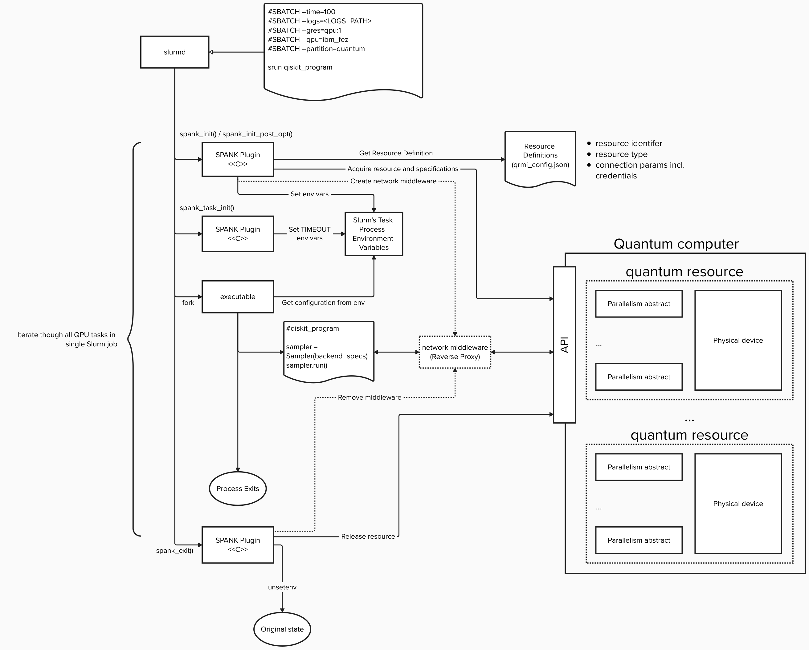

Spank plugins for Slurm to support quantum resources
====================================================

## Content

- [Context](#content)
- [Definitions](#definitions)
  - [QPU](#qpu)
  - [Quantum computer](#quantum-computer)
  - [IBM Quantum Platform](#ibm-quantum-platform)
  - [Direct Access API](#direct-access-api) 
  - [Spank plugins](#spank-plugins)
  - [Spank quantum plugin](#spank-quantum-plugin)
  - [Qiskit primitives (Sampler and Estimator)](#qiskit-primitives-sampler-and-estimator)
- [High Level Structure](#high-level-structure) 
- [Quantum resource for workload management systems](#quantum-resource-for-workload-management-system)
- [Quantum resource API](#quantum-resource-api)
- [UX](#ux)
  - [Backend selection as part of the configuration](#backend-selection-as-part-of-the-configuration)
  - [Running primitive jobs](#running-primitive-jobs)
  - [Running hybrid quantum-classical job with multiple resources](#running-quantum-classical-job-with-multiple-resoures)
  - [Running complex workflows](#running-complex-workflows)
- [Integration Flow](#integration-flow)
- [General architecture](#general-architecture-of-plugin)
- [Architectural Tenets](#architectural-tenents)

## Context

Overview of involved components, personas and backend service options:


## Definitions

### QPU
A `QPU` includes all of the hardware responsible for accepting an executable quantum instruction set, or a quantum circuit, and returning an accurate answer. That means the QPU includes the quantum chip(s) in a superconducting quantum computer, as well as additional components such as the amplifiers, control electronics, instruments.

### Quantum Computer
A `Quantum Computer` is comprised of the QPU and the classical compute needed to execute requests coming in through an API (its endpoint).

### IBM Quantum Platform
Cloud-based quantum computing iservice providing access to IBM's fleet of quantum backends. Sometimes abbreviated as IQP.

### Direct Access API
Local interface to am IBM Quantum Computer. Sometimes abbreviated as DA API. Below the Direct Access API, classical preparation of jobs prior to the actual quantum execution can run in parallel (called *lanes* in the API definition).

### Spank plugins
`SPANK` provides a very generic interface for stackable plug-ins which may be used to dynamically modify the job launch code in Slurm.
https://slurm.schedmd.com/spank.html

### Spank quantum plugin
A plugin in slurm that manages the operation of quantum jobs in slurm. It handles slurm resources related to quantum and is configured so that jobs can execute on Quantum Computers. 

### Qiskit primitives (Sampler and Estimator)
The two most common tasks for quantum computers are sampling quantum states and calculating expectation values. These tasks motivated the design of the Qiskit primitives: `Estimator` and `Sampler`.

- Estimator computes expectation values of observables with respect to states prepared by quantum circuits.
- Sampler samples the output register from quantum circuit execution.

In short, the computational model introduced by the Qiskit primitives moves quantum programming one step closer to where classical programming is today, where the focus is less on the hardware details and more on the results you are trying to achieve.

## High Level Structure

At large, there are three domains:
* HPC users, consuming slurm resources and using access to Quantum Computers through these resources
* HPC admins, configuring slurm and managing access and mapping to available Quantum Computers
* Quantum Computer providers, offering access to Quantum/QPU resources on Quantum Computers



## Quantum resource for workload management system
General GRES (custom resource) for quantum computers is QPU.
All quantum resources will have an identity and map to a Quantum Computer's quantum resource (i.e. map to a QPU).

Additional resource definition might be needed depending on implementation from hardware vendors. Some vendors expose to parallelism within quantum computer as execution lanes, threads, parts of devices, etc. Therefore we define quantum resource as an abstract that composed out of physical device and parallelism notion.


The QPU resource definition does not expose individual parallelism abstracts. Each backend flavor can have specific qualifiers how to use backend specific capabilities (e.g. for common use case: if a user wants to exclusively use a backend, all parallel job preparation units will be available for use -- if not, several users could submit jobs and share these units. As execution lanes in DA API do not have any identities that could be managed explicitly, only quantities resp. exclusive/shared use should be user controlled).



## Quantum resource API
Any type of resource should implement resource control interface. Flow of working with resource following pattern: `acquire resource` → `execute` → `release resource`. Implementation of this interface might vary from platform to platform.


## UX

### Backend selection as part of the configuration

Quantum resources are defined through slurm level resources, and so the backend selection is a part of the configuration and slurm-level resource definition, rather than source code.

Accordingly, this would identify the backend used in the slurm resource definition (which feels like configuration)

```shell
#SBATCH --gres=qpu:my_qpu_resource
#SBATCH --qpu_backend=ibm_fez
```

and then be bound in the actual source code with something like this:

```python
backend=slurm_provider(name="my_qpu_resource")
```

Note exact syntax is not the point here and needs refinement, but the conceptual separation of resource definition (which includes backend selection/selection policy) and binding to the resource when using it. In that spirit, slurm provides access to the backends it is configured with.

As transpilation needs the backend information, this eventually can be a two step process, which only locks the backend when it's used, but offers binding in source for transpilation before acquiring the lock. In an initial implementation, transpilation can be done while holding the lock, not impacting machine utilization dramatically in practice for large workloads.

### Running primitive jobs

Slurm require executable for any of it's scommands. Therefore for running primitive tasks (sample and estimate) one might want to have cli interface like `qrun`.

```shell
#SBATCH --time=100
#SBATCH --output=<LOGS_PATH>
#SBATCH --gres=qpu:1
#SBATCH --q_backend=ibm_fez
#SBATCH --partition=quantum
#SBATCH --... # other options

srun qrun/sample/estimate <payload_path> <output_path>
```

### Running quantum-classical job with multiple resoures

For more traditional user experience working with Slurm and Qiskit one might use quantum-classical program as executable for slurm commands.

```shell
#SBATCH --time=100
#SBATCH --output=<LOGS_PATH>
#SBATCH --gres=qpu:1
#SBATCH --q_backend=ibm_fez
#SBATCH --partition=quantum
#SBATCH --... # other options

srun my_hybrid_quantum_classical_program.py
```

where `my_hybrid_quantum_classical_program.py` will be something like

```python
from qiskit_slurm_provider import Sampler

...

sampler = Sampler()
while ...:
    do_classical()
    ...
    isa_circuit = ...
    result = sampler.run([isa_circuit], ...).result()
    ...
    do_classical()

...
```

Since slurm resources have an identity, they can be distinguished in in the qiskit-level code.

### Running complex workflows

In cases where one do not need fast interchange between quantum and classical resources it is benificial to separate program logic into separate jobs. For example preprocessing, quantum execution and postprocessing.

Preprocess classically and prepare quantum payload.
```shell
#SBATCH --partition=classical
#SBATCH --... # other options

srun preprocessing.py <payload_path>
```

Execute quantum payload.
```shell
#SBATCH --time=100
#SBATCH --output=<LOGS_PATH>
#SBATCH --gres=qpu:1
#SBATCH --q_backend=ibm_fez
#SBATCH --partition=quantum
#SBATCH --... # other options

srun qrun/sample/estimate <payload_path> <output_path>
```

Postprocess classically quantum results.
```shell
#SBATCH --partition=classical
#SBATCH --... # other options

srun postprocessing.py <output_path>
```

One can use any workflow management tool to chain this jobs into large workflow.

## Integration Flow

Similar to any Gres resource (GPU, AIU, etc), we treat QPU as gres and acquire it for whole duration of the job.
Primitive calls will manage the data and call towards the Quantum Computer (for most cases through slurm to govern user access to the slurm-level quantum resource and potentially inject Quantum Computer access credentials)


This avoids drawbacks of other options, e.g. when the user application's primitive call will create other slurm jobs that send primitive data towards the Quantum Computer.
Having this logic of sending data towards the Quantum Computer in qiskit level code reduces complexity and latency, and avoids complexity in error handling.

## General architecture of plugin

Quantum plugin will be using Spank architecture events sequence of call during job execution to inject necessary logic to work with quantum computer API.

1. Job execution flow
    1. Prolog
        1. Handle secrets
        2. Acquire resource
        3. Create network middleware
    2. Task init
        1. Handle options
        2. Set env variables
    3. Epilog
        1. Remove middleware
        2. Release resource



## Architectural Tenents

* A Slurm-level QPU resource maps to physical resource of a Quantum Computer
  * Quantum backend selection is part of that slurm resource definition and is considered configuration, not source code
  * Qiskit-level code can refer to that slurm resource and access/use the quantum resource behind it. Qiskit-level code should avoid naming the desired backend directly (=> it should be part of the slurm resource definition instead)
  * slurm QPU resources have an identity (allowing to bind against it from qiskit)
  * additional qualifiers of the slurm QPU resource are backend type specific
  * parallelism abstracts (such as execution lanes which are anonymous units to prepare jobs in parallel for quantum execution which is still serialized) are abstracted behind the slurm QPU resource. Qualifiers may be used to deal with specifics (such as: are these lanes held exclusive for one user, or is there a shared access possible)
* Quantum resources are acquired/locked before usage
  * as identification/selection of the quantum resource is through the slurm resource, transpilation can only happen after that
  * initially, transpilation will happen after acquiring the resource, which can can lead to slightly lower QPU utilization, as other jobs may be locked out. This may be improved in a later phase.
* Primitive calls will trigger submission towards the Quantum Computer
  * Flow is triggered from the qiskit-level code, without scheduling additional intermediate slurm jobs
  * The network flow can go through the slurm plugin, to govern user access or manage access to the Quantum Computer
  * The network/data flow can be specific to a backend type (using intermediate storage to hold input/output data, or sending data in-line)